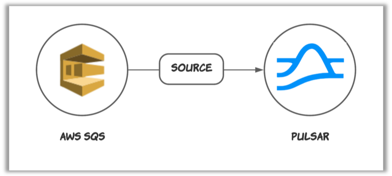
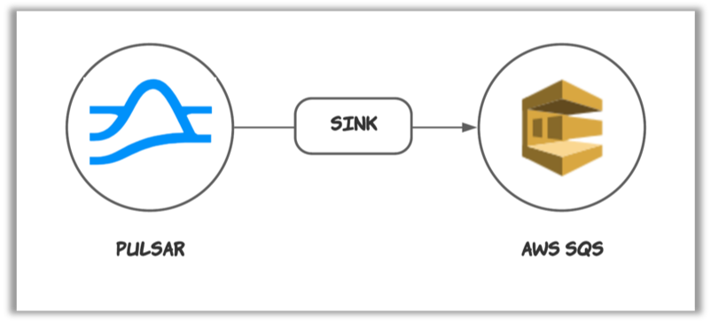

# AWS SQS connector

The [AWS Simple Queue Service (SQS)](https://aws.amazon.com/sqs/?nc1=h_ls) connector is a [Pulsar IO connector](http://pulsar.apache.org/docs/en/next/io-overview/) for copying data between Amazon AWS SQS and Pulsar. It contains two types of connectors: 

- SQS **source** connector
  
  This connector feeds data from AWS SQS and writes data to Pulsar topics. 

  

- SQS **sink** connector  
  
  This connector pulls data from Pulsar topics and persists data to AWS SQS.

  

Currently, SQS connector versions (`x.y.z`) are based on Pulsar versions (`x.y.z`).

| SQS connector version | Pulsar version | Doc |
| :---------- | :------------------- | :------------- |
[2.7.0](https://github.com/streamnative/pulsar-io-sqs/releases/tag/v2.7.0)| [2.7.0](http://pulsar.apache.org/en/download/) | - [SQS source connector](https://hub.streamnative.io/connectors/sqs-source/2.7.0)<br>- [SQS sink connector](https://hub.streamnative.io/connectors/sqs-sink/2.7.0)

## Project layout

Below are the sub folders and files of this project and their corresponding descriptions.

```bash

├── conf // examples of configuration files of this connector
├── docs // user guides of this connector
├── script // scripts of this connector
├── src // source code of this connector
│   ├── checkstyle // checkstyle configuration files of this connector
│   ├── license // license header for this project. `mvn license:format` can
    be used for formatting the project with the stored license header in this directory
│   │   └── ALv2
│   ├── main // main source files of this connector
│   │   └── java
│   ├── spotbugs // spotbugs configuration files of this connector
│   └── test // test related files of this connector
│       └── java

```

## License
[](https://app.fossa.io/projects/git%2Bgithub.com%2Fstreamnative%2Fpulsar-io-sqs?ref=badge_large)
